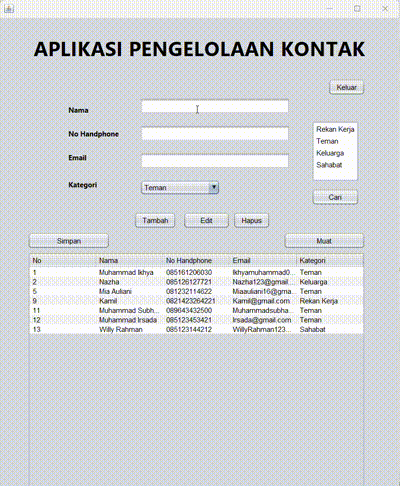

# AplikasiPengelolaanKontak

## Deskripsi
AplikasiPengelolaanKontak adalah aplikasi berbasis Java yang digunakan untuk mengelola kontak. Aplikasi ini memungkinkan pengguna untuk menambah, mengedit, menghapus, dan menyimpan kontak ke dalam database MySQL. Selain itu, pengguna juga dapat memfilter kontak berdasarkan kategori dan menyimpan serta memuat data kontak dari file CSV.

## Fitur Utama
- **Tambah Kontak**: Menambahkan kontak baru dengan nama, nomor telepon, email, dan kategori.
- **Edit Kontak**: Mengedit informasi kontak yang sudah ada.
- **Hapus Kontak**: Menghapus kontak yang dipilih dari daftar.
- **Filter Kontak**: Memfilter kontak berdasarkan kategori yang dipilih.
- **Simpan ke CSV**: Menyimpan daftar kontak ke dalam file CSV.
- **Muat dari CSV**: Memuat daftar kontak dari file CSV.
- **Koneksi Database**: Menggunakan MySQL untuk menyimpan dan mengelola data kontak.

## Prasyarat
- Java Development Kit (JDK) 8 atau lebih baru.
- MySQL Server.
- Driver JDBC untuk MySQL.
- IDE seperti IntelliJ IDEA atau Eclipse untuk menjalankan aplikasi.

## Instalasi
1. **Clone Repository**:
2. **Setup Database**:
   - Buat database baru di MySQL dengan nama `jcontact`.
   - Buat tabel `contacts` dengan struktur berikut:
     ```  
3. **Konfigurasi Koneksi Database**:
   - Ubah parameter koneksi database di dalam metode `connectToDatabase()` pada kelas `AplikasiPengelolaanKontakFrame` sesuai dengan pengaturan MySQL Anda (username, password, dan nama database).

4. **Jalankan Aplikasi**:
   - Buka proyek di IDE Anda dan jalankan kelas `AplikasiPengelolaanKontakFrame`.

## Penggunaan
- **Menambah Kontak**: Isi nama, nomor telepon, email, dan pilih kategori, lalu klik tombol "Tambah".
- **Mengedit Kontak**: Pilih kontak dari tabel, ubah informasi yang diinginkan, lalu klik tombol "Edit".
- **Menghapus Kontak**: Pilih kontak dari tabel dan klik tombol "Hapus".
- **Menyimpan Kontak**: Klik tombol "Simpan" untuk menyimpan data kontak ke file CSV.
- **Memuat Kontak**: Klik tombol "Muat" untuk memuat data kontak dari file CSV.
- **Mencari Kontak**: Pilih kategori dari daftar dan klik tombol "Cari" untuk memfilter kontak berdasarkan kategori tersebut.

## Penulis
- Muhammad Ikhya
- NIM: 2210010405

## Lisensi
Aplikasi ini dilisensikan di bawah [MIT License](LICENSE).

## Catatan
Pastikan untuk menginstal semua dependensi yang diperlukan dan mengonfigurasi database dengan benar sebelum menjalankan aplikasi. Jika ada pertanyaan atau masalah, silakan hubungi penulis.


 Latihan 3 - Muhammad Ikhya 2210010405

 ## Demo
 
